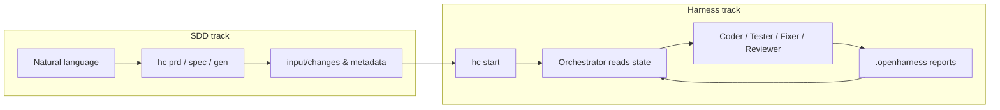

<p align="center">
  
</p>

<p align="center">
  <em><strong>openHarness</strong> wires <strong>spec-driven development (SDD)</strong> and a <strong>Harness multi-agent loop</strong> into one CLI. Swap execution engines (OpenCode, Claude Code, Codex CLI); runtime state lives under <code>.openharness/</code> in your project.</em>
</p>

<p align="center">
  <strong>Write specs first, run the loop second, inspect state throughout.</strong><br/>
  openHarness is built for real project workflows, not just one-shot code generation.
</p>

<p align="center">
  <a href="README_CN.md">简体中文</a> | <b>English</b>
</p>

<p align="center">
  <a href="#quick-start">Quick start</a> ·
  <a href="#how-it-works-two-tracks">How it works</a> ·
  <a href="#install-and-tooling">Install</a> ·
  <a href="#command-reference">Commands</a> ·
  <a href="#layout-and-inputs">Layout</a> ·
  <a href="#contributing">Contributing</a>
</p>

<p align="center">
  
  
  
  
  
</p>

---

## Quick start

Before the commands, the key mental model is simple: openHarness is a **spec input layer + orchestrated execution loop**, not a single prompt runner.

### What you get

- **🧭 Spec entry points**: start from `tech-stack.md`, PRD, techspec, or change-scoped `input/changes/`.
- **🛠 Execution loop**: `Orchestrator -> Coder / Tester / Fixer / Reviewer`, driven by project state.
- **👀 Observable state**: runtime files are written under `.openharness/`, with `hc monitor` for a read-only view.
- **🔀 Switchable engines**: use the same workflow with OpenCode, Claude Code, or Codex CLI.

### Fast path

1. **Clone and install the Python package** (editable install shown):
   ```bash
   git clone https://github.com/hahaxiang27/openHarness.git
   cd openHarness
   python -m pip install -e .
   hc --version
   ```
2. **In your application repo root**, add `input/prd/tech-stack.md` (exact filename) and optional `input/techspec/` snippets.
3. **Initialize**: `hc init` (optional `--backend opencode|claude|codex`).
4. **Run the loop**: `hc start`.
5. **Watch progress**: run `hc monitor` in another terminal for a read-only dashboard (default `127.0.0.1:8765`).

For **change-scoped SDD** (`input/changes/<change-id>/`), read [docs/sdd-harness-generation-architecture.md](docs/sdd-harness-generation-architecture.md), then use `hc prd`, `hc spec`, `hc gen`, and `hc change` before `hc start`.

---

## How it works (two tracks)

openHarness separates **what to build** (specs, change folders) from **how it is executed and verified** (Orchestrator + workers). Both sides meet through files on disk and `.openharness/` state—not a single giant prompt.



**Typical agents**

| Agent | Purpose |
|------|---------|
| Orchestrator | Reads `.openharness/` and logs; decides the next worker |
| Initializer | First-time PRD/spec scan; builds feature list |
| Coder / Tester / Fixer / Reviewer | Implement, verify, fix, review |

Human-in-the-loop: blocking items surface in `missing_info.json` (and related logs) so you can resolve them before resuming.

### Execution architecture

```text
┌──────────────────────────────────────────────────────────────┐
│                        Orchestrator                          │
│     Read .openharness state -> decide next step -> dispatch  │
└───────────────────────┬──────────────────────────────────────┘
                        │
        ┌───────────────┼───────────────┬───────────────┐
        │               │               │               │
        ▼               ▼               ▼               ▼
┌────────────┐  ┌────────────┐  ┌────────────┐  ┌────────────┐
│   Coder    │  │   Tester   │  │   Fixer    │  │  Reviewer  │
│ Implement  │  │  Validate  │  │   Repair   │  │   Review   │
└──────┬─────┘  └──────┬─────┘  └──────┬─────┘  └──────┬─────┘
       └───────────────┴───────────────┴───────────────┘
                               │
                               ▼
                  .openharness state files and reports
```

---

## Layout and inputs

**Generated at runtime (do not commit blindly)**

```
your-project/
├── .openharness/
│   ├── config.yaml
│   ├── feature_list.json
│   ├── test_report.json
│   ├── review_report.json
│   ├── missing_info.json
│   └── …
├── dev-log.txt
└── input/
    ├── prd/tech-stack.md        # required filename
    ├── techspec/                # optional stack-specific rules
    ├── changes/                 # optional SDD change bundles
    └── …
```

- SDD directory contract: [docs/sdd-harness-generation-architecture.md](docs/sdd-harness-generation-architecture.md)  
- Backend architecture: [docs/harness-backend-architecture-overview.md](docs/harness-backend-architecture-overview.md)

---

## Install and tooling

**Prerequisites**: Python 3.8+; **at least one** of OpenCode, Claude Code, or Codex CLI installed and on PATH.

<details>
<summary><strong>Install AI CLIs (pick what you use)</strong></summary>

**OpenCode** — see [opencode.ai](https://opencode.ai) for Windows / macOS / Linux (e.g. `scoop`, `brew`, or `npm install -g opencode-ai`).

**Claude Code**

```bash
npm install -g @anthropic-ai/claude-code
claude auth login
```

**Codex CLI**

```bash
npm install -g @openai/codex
codex login
```

</details>

**Install the openHarness package** (PyPI name `openharness`, CLI entry `hc`):

```powershell
python -m pip install --upgrade pip
python -m pip install -e .
hc --version
```

Use a venv if your OS enforces PEP 668: `pip install openharness` or `pip install -e .` inside the venv.

<details>
<summary><strong>Troubleshooting</strong></summary>

- **`hc` not found**: add Python `Scripts` (Windows) or `~/.local/bin` (Unix) to PATH.
- **`externally-managed-environment`**: create a virtualenv, then install.

</details>

---

## Command reference

| Command | Description |
|---------|-------------|
| `hc init` | Interactive init (backend, branches, learning dirs) |
| `hc start` | Main Harness loop |
| `hc status` | Project metrics and recent success rates |
| `hc restore` | Restore config from backup |
| `hc uninstall` | Remove agent installs and project `.openharness` (prompted) |
| `hc prd` / `hc spec` / `hc gen` | SDD change generation (see SDD doc) |
| `hc change` | List / switch active change |
| `hc monitor` | Local read-only monitor (`--host` / `--port` / `--open`) |
| `hc --version` | Version |

Examples:

```bash
hc init --backend claude
hc init --backend codex
hc start --backend opencode
```

---

## Environment variables

| Variable | Purpose |
|----------|---------|
| `OPENHARNESS_BACKEND` | Default engine (`opencode` / `claude` / `codex`); legacy `HARNESSCODE_BACKEND` still read |
| `OPENCODE_PATH` / `CLAUDE_PATH` / `CODEX_PATH` | Override CLI binary paths |
| `OPENHARNESS_WEBHOOK_URL` | Optional webhooks; legacy `HARNESSCODE_WEBHOOK_URL` still read |

---

## Repository layout

```
openHarness/                 # repo root (PyPI: openharness)
├── docs/
├── src/openharness/
│   ├── cli.py
│   ├── infinite_dev.py
│   ├── backend.py
│   ├── agents/
│   ├── generator/
│   └── runtime/
└── input/                     # sample inputs
```

---

## Uninstall

```bash
hc uninstall
pip uninstall openharness
```

---

## Contributing

Issues and pull requests are welcome on [GitHub Issues](https://github.com/hahaxiang27/openHarness/issues). Install from source:

```bash
git clone https://github.com/hahaxiang27/openHarness.git
cd openHarness
python -m pip install -e .
```

---

## License

[MIT](LICENSE)

---

<p align="center">
  <strong>openHarness</strong> · <a href="https://github.com/hahaxiang27/openHarness">github.com/hahaxiang27/openHarness</a>
</p>
