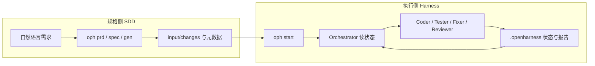

<p align="center">
  
</p>

<p align="center">
  <em><strong>openHarness</strong>：把「规格（SDD）」和「多 Agent 执行闭环（Harness）」接在同一套 CLI 里；执行引擎可在 OpenCode / Claude Code / Codex CLI 之间切换，状态落在项目内的 <code>.openharness/</code>。</em>
</p>

<p align="center">
  <strong>先写规格，再跑循环，再看状态。</strong><br/>
  一个面向真实项目的 AI 开发工作台，而不只是“调用一次大模型生成代码”。
</p>

<p align="center">
  <b>简体中文</b> | <a href="README.md">English</a>
</p>

<p align="center">
  <a href="#快速开始">快速开始</a> ·
  <a href="#工作方式两条线">工作方式</a> ·
  <a href="#安装与环境">安装与环境</a> ·
  <a href="#命令参考">命令参考</a> ·
  <a href="#目录状态与输入物">目录与状态</a> ·
  <a href="#参与贡献">贡献</a>
</p>

<p align="center">
  
  
  
  
  
</p>

---

## 快速开始

开始之前，先记住 openHarness 不是“单次生成器”，而是一套 **规格输入 + Orchestrator 调度 + 多 Agent 反馈闭环** 的开发运行方式。

### ✨ 你会得到什么

- **🧭 规格入口**：可以直接从 `tech-stack.md`、PRD、techspec 或变更级 `input/changes/` 启动。
- **🛠 执行闭环**：`Orchestrator -> Coder / Tester / Fixer / Reviewer` 按状态持续推进。
- **👀 可观测过程**：运行状态写入 `.openharness/`，并可通过 `oph monitor` 查看过程。
- **🔀 可切换后端**：同一套命令可切到 OpenCode、Claude Code、Codex CLI。

### 🚀 最短上手路径

1. **获取代码并安装 Python 包**（开发模式示例）  
   ```bash
   git clone https://github.com/hahaxiang27/openHarness.git
   cd openHarness
   python -m pip install -e .
   oph --version
   ```
2. **在目标业务项目根目录**准备 `input/prd/tech-stack.md`（文件名固定），并按需放置 `input/techspec/` 下的规范片段。
3. **初始化并选择后端**：`oph init`（可用 `--backend opencode|claude|codex`）。
4. **启动主循环**：`oph start`。
5. **观察过程**：另开终端运行 `oph monitor`，打开只读监控页（默认 `127.0.0.1:8765`）。

若使用 **变更级 SDD 工作流**（需求写在 `input/changes/<change-id>/`），可先阅读 [docs/sdd-harness-generation-architecture.md](docs/sdd-harness-generation-architecture.md)，再用 `oph prd` / `oph spec` / `oph gen` 与 `oph change` 管理活动变更，最后对当前活动变更执行 `oph start`。

---

## 工作方式（两条线）

openHarness 把问题拆成两条可协作的线：**规格侧**写清「做什么」，**执行侧**负责「怎么落地与验证」；中间通过项目目录里的文件与 `.openharness/` 状态打通，而不是把整本说明书塞进一条提示词。



**执行侧常见角色（Agent）**  

| 角色 | 做什么 |
|------|--------|
| Orchestrator | 读 `.openharness/` 与日志，决定下一步派谁 |
| Initializer | 首次扫描 PRD/规格，整理功能列表等 |
| Coder / Tester / Fixer / Reviewer | 实现、验证、按报告修复与审查 |

人在回路：当出现需人工补充的信息时，会体现在 `missing_info.json` 等文件中，可配合 `oph start` 的暂停逻辑处理。

### 执行架构总览

```text
┌──────────────────────────────────────────────────────────────┐
│                        Orchestrator                          │
│        读取 .openharness 状态 → 决策下一步 → 调度 Agent      │
└───────────────────────┬──────────────────────────────────────┘
                        │
        ┌───────────────┼───────────────┬───────────────┐
        │               │               │               │
        ▼               ▼               ▼               ▼
┌────────────┐  ┌────────────┐  ┌────────────┐  ┌────────────┐
│   Coder    │  │   Tester   │  │   Fixer    │  │  Reviewer  │
│  实现功能   │  │  运行验证   │  │  修复问题   │  │  规则审查   │
└──────┬─────┘  └──────┬─────┘  └──────┬─────┘  └──────┬─────┘
       └───────────────┴───────────────┴───────────────┘
                               │
                               ▼
                   .openharness/ 状态文件与报告回写
```

---

## 目录状态与输入物

**运行时（随运行生成，勿手改提交）**

```
你的项目根/
├── .openharness/
│   ├── config.yaml
│   ├── feature_list.json
│   ├── test_report.json
│   ├── review_report.json
│   ├── missing_info.json
│   └── …
├── dev-log.txt
└── input/
    ├── prd/tech-stack.md      # 必须：技术栈自描述
    ├── techspec/              # 按项目拆分规范，内容自定
    ├── changes/               # 可选：按变更组织的 PRD/techspec（SDD 流）
    └── …
```

更细的 SDD 目录约定见 [docs/sdd-harness-generation-architecture.md](docs/sdd-harness-generation-architecture.md)；后端与模块边界见 [docs/harness-backend-architecture-overview.md](docs/harness-backend-architecture-overview.md)。

---

## 安装与环境

**硬性前提**：Python 3.8+；至少安装并能在 PATH 中找到一种执行引擎（OpenCode / Claude Code / Codex CLI 之一）。

<details>
<summary><strong>安装各 AI CLI（按需选一种或多种）</strong></summary>

**OpenCode**（Windows / macOS / Linux 任选其一，以官方为准）

```powershell
# Windows 示例
scoop install opencode
# 或
npm install -g opencode-ai
```

```bash
# macOS 示例
brew install anomalyco/tap/opencode
# 或
npm install -g opencode-ai
```

```bash
# Linux 示例
curl -fsSL https://opencode.ai/install | bash
# 或
npm install -g opencode-ai
```

**Claude Code**

```bash
npm install -g @anthropic-ai/claude-code
claude auth login
```

**Codex CLI**

```bash
npm install -g @openai/codex
codex login
```

</details>

**安装 openHarness 包**（PyPI 包名 `openharness`，命令行入口仍为 `oph`）

```powershell
# Windows
python -m pip install --upgrade pip
python -m pip install -e .
oph --version
```

```bash
# macOS / Linux
python3 -m pip install --upgrade pip
python3 -m pip install -e .
oph --version
```

也可在虚拟环境中：`pip install openharness`（若已发布到 PyPI）。

<details>
<summary><strong>排错：找不到 oph、PEP 668 等</strong></summary>

- **找不到 `oph`**：把 Python 的 `Scripts`（Windows）或 `~/.local/bin`（Unix）加入 PATH；可用 `python -c "import sysconfig; print(sysconfig.get_path('scripts'))"` 查看脚本目录。
- **`externally-managed-environment`**：新建 venv 后再 `pip install openharness` 或 `pip install -e .`。

</details>

---

## 命令参考

| 命令 | 说明 |
|------|------|
| `oph init` | 交互式初始化（分支、后端、`~/.openharness` 学习数据等） |
| `oph start` | 启动 Harness 主循环 |
| `oph status` | 查看项目指标与近期成功率 |
| `oph restore` | 从备份恢复配置（如 PR 前备份） |
| `oph uninstall` | 清理本机 Agent 安装与项目内 `.openharness` 等（按提示） |
| `oph prd` / `oph spec` / `oph gen` | 按自然语言生成或更新变更级 PRD、techspec、整套产物（见 SDD 文档） |
| `oph change` | 列出 / 切换当前活动变更 |
| `oph monitor` | 本地只读监控（`--host` / `--port` / `--open`） |
| `oph --version` | 版本信息 |

常用覆盖后端示例：

```bash
oph init --backend claude
oph init --backend codex
oph start --backend opencode
```

---

## 环境变量

| 变量 | 说明 |
|------|------|
| `OPENHARNESS_BACKEND` | 默认引擎：`opencode` / `claude` / `codex`（兼容旧名 `HARNESSCODE_BACKEND`） |
| `OPENCODE_PATH` / `CLAUDE_PATH` / `CODEX_PATH` | 自定义对应可执行文件路径 |
| `OPENHARNESS_WEBHOOK_URL` | 可选：Webhook 通知（兼容旧名 `HARNESSCODE_WEBHOOK_URL`） |

---

## 本仓库布局（开发视角）

```
openHarness/                    # 仓库根（PyPI：`openharness`）
├── docs/                       # 架构与 SDD 说明
├── src/openharness/            # Python 包
│   ├── cli.py
│   ├── infinite_dev.py
│   ├── backend.py
│   ├── agents/
│   ├── generator/
│   └── runtime/
└── input/                      # 示例输入，可复制到业务项目
```

---

## 卸载

```bash
oph uninstall
pip uninstall openharness
```

---

## 参与贡献

欢迎在 [GitHub Issues](https://github.com/hahaxiang27/openHarness/issues) 反馈问题或提交 PR。从源码安装：

```bash
git clone https://github.com/hahaxiang27/openHarness.git
cd openHarness
python -m pip install -e .
```

---

## License

[MIT](LICENSE)

---

<p align="center">
  <strong>openHarness</strong> · <a href="https://github.com/hahaxiang27/openHarness">github.com/hahaxiang27/openHarness</a>
</p>
