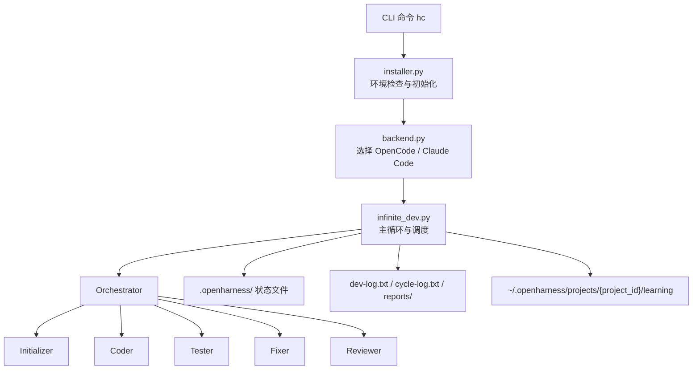

# openHarness 后台架构整体介绍

## 1. 文档目标

本文基于当前仓库实现，对 openHarness 自身的“后台”能力做整体说明。这里的“后台”不是传统 Web API 服务，而是指运行在本地开发环境中的任务编排内核，负责初始化项目、调度多 Agent 执行、维护状态文件、记录学习数据，并通过不同 AI 执行引擎驱动完整开发闭环。

本文适合用于以下场景：

- 向团队介绍 openHarness 的后端运行机制
- 为技术方案、设计说明或培训材料提供架构背景
- 帮助后续开发者理解代码入口、模块边界和关键文件

---

## 2. 系统定位

openHarness 是一个以 CLI 为入口、以本地文件为状态总线、以多 Agent 协作为执行模型的开发自动化框架。系统不依赖中心化服务，也不提供常驻 HTTP 进程；它通过 `hc init` 和 `hc start` 这两个主要命令完成项目初始化和持续开发循环。

从架构角色上看，openHarness 后台主要承担五类职责：

1. 命令入口与环境引导
2. AI 执行后端抽象
3. 多 Agent 调度与主循环控制
4. 项目状态、日志、指标与知识沉淀
5. 本地配置与运行时文件治理

---

## 3. 总体架构

这套架构可以概括为一条主链路：

`CLI 入口 -> 环境准备 -> 后端选择 -> 主循环调度 -> Agent 执行 -> 状态回写 -> 下一轮决策`

其中，真正的“控制面”集中在 `infinite_dev.py`，而真正的“执行面”则由不同 Agent 提示词文件配合外部 AI CLI 完成。

---

## 4. 分层设计

### 4.1 CLI 接入层

CLI 接入层位于 `src/openharness/cli.py`，职责包括：

- 解析命令：`init`、`start`、`status`、`restore`、`uninstall`
- 提取 `--backend` 参数
- 在具体命令执行前统一调用安装与初始化检查
- 将请求路由到不同模块

这一层比较薄，重点是提供统一入口和稳定的命令体验，不承载复杂业务逻辑。

### 4.2 安装与引导层

安装与引导层位于 `src/openharness/installer.py`，主要负责：

- 检查并安装基础 Python 依赖，例如 `pyyaml`
- 自动创建 `input/prd`、`input/techspec` 目录
- 将 openHarness 自带 Agent 模板安装到目标 AI 后端目录
- 为 OpenCode 合并 `opencode.json` 配置
- 检查并提示 AI 引擎是否已安装
- 管理 `.gitignore` 和 Git 初始化

这一层的目标是确保项目在进入正式开发循环前，具备可运行的最小环境。

### 4.3 AI 后端抽象层

AI 后端抽象位于 `src/openharness/backend.py`，通过 `Backend` 抽象基类统一定义以下能力：

- 获取命令路径
- 构建 agent 运行命令
- 获取配置目录和 Agent 安装目录
- 安装和卸载 Agent
- 合并后端配置
- 探测是否已安装
- 查询可用模型

当前有两个实现：

- `OpenCodeBackend`
- `ClaudeCodeBackend`
- `CodexBackend`

这一层把“开发框架逻辑”和“具体 AI CLI 差异”隔离开，使上层主循环只依赖统一接口。

### 4.4 编排与执行层

编排与执行层位于 `src/openharness/infinite_dev.py`，是整个后台的核心。它负责：

- 初始化运行上下文
- 选择模型
- 驱动 Orchestrator 决策
- 执行具体 Agent
- 解析 Agent 输出
- 检测死循环、假完成、超时与阻塞
- 生成报告和通知

如果把 openHarness 视为一个轻量运行时，那么 `infinite_dev.py` 就是它的调度器、状态机和守护器。

### 4.5 状态与知识管理层

状态与知识管理主要由以下模块构成：

- `src/openharness/utils/config.py`：配置路径、项目目录、学习目录定位
- `src/openharness/utils/project_id.py`：生成和持久化稳定 `project_id`
- `src/openharness/utils/metrics.py`：记录 Agent 成功率和近期执行结果
- `src/openharness/knowledge_manager.py`：把修复经验沉淀为 bug pattern 文档
- `src/openharness/restore_config.py`：从备份恢复配置文件

这一层没有复杂业务编排，但承担了系统可追踪、可恢复、可复用的基础能力。

---

## 5. 核心模块职责

| 模块 | 说明 | 关键价值 |
|---|---|---|
| `cli.py` | 统一命令入口 | 降低使用门槛 |
| `installer.py` | 安装、初始化、目录准备、Agent 部署 | 保证首次运行可用 |
| `backend.py` | OpenCode / Claude 适配层 | 解耦 AI 引擎差异 |
| `infinite_dev.py` | 主循环、调度、监控、报告 | 系统控制中枢 |
| `knowledge_manager.py` | 失败修复知识沉淀 | 累积项目级经验 |
| `utils/config.py` | 配置与目录定位 | 统一运行路径 |
| `utils/project_id.py` | 项目标识生成 | 支撑跨运行的学习隔离 |
| `utils/metrics.py` | 执行指标统计 | 支撑可观测性 |
| `restore_config.py` | 配置恢复 | 降低误改风险 |

---

## 6. Agent 协作架构

openHarness 的业务执行不是写死在 Python 代码里，而是由“Python 调度器 + Agent 提示词”共同完成。

### 6.1 Agent 角色划分

当前系统内置六类 Agent：

- `Orchestrator`：读取状态并决定下一步
- `Initializer`：初始化项目上下文、生成功能清单和上下文产物
- `Coder`：实现具体功能
- `Tester`：执行静态检查、单测和编译检查
- `Fixer`：根据测试或审查结果修复问题
- `Reviewer`：对增量代码做规范审查

### 6.2 设计思想

这种设计把“流程控制”和“任务执行”分开：

- Python 后台负责稳定的流程控制和状态管理
- Agent 提示词负责动态的开发行为与判断细节

优点是扩展成本低，便于演进；代价是系统对提示词质量、状态文件契约以及 AI 输出格式存在依赖。

### 6.3 Orchestrator 的控制作用

`Orchestrator` 读取多个状态文件后，根据优先级表决定下一步，例如：

- 初始化未完成时调用 `Initializer`
- 测试失败时调用 `Fixer`
- 仍有待开发功能时调用 `Coder`
- 功能完成后调用 `Tester` 与 `Reviewer`
- 所有条件满足后宣布项目完成

因此，Orchestrator 本质上是整个系统的策略路由器。

---

## 7. 主执行流程

### 7.1 初始化流程

执行 `hc init` 后，系统会进行以下动作：

1. 检测或选择 AI 后端
2. 扫描项目内 Git 仓库并引导选择分支
3. 询问 `auto_commit` 配置
4. 创建 `.openharness/config.yaml`
5. 生成 `project_id`

初始化的结果是让当前项目具备稳定的运行上下文。

### 7.2 开发循环流程

执行 `hc start` 后，系统进入持续循环：

1. 加载当前后端与模型
2. 初始化日志、指标、知识管理器
3. 调用 `Orchestrator`
4. 解析下一步 Agent 决策
5. 运行目标 Agent
6. 记录结果、写入指标和周期日志
7. 校验是否存在假完成、阻塞或重复决策
8. 未结束则进入下一轮

### 7.3 执行保护机制

当前实现中存在多项运行保护：

- 空闲超时杀进程，避免 AI CLI 长时间卡死
- 连续相同决策检测，降低无限循环风险
- `PROJECT COMPLETE` 二次校验，避免误判完成
- `missing_info.json` 阻塞检测，支持人工介入
- 多层报告校验，防止跳过测试和审查

这些保护逻辑说明 openHarness 并不是简单地“调用一下 AI”，而是在尝试构建一个可持续运行的自动化闭环。

---

## 8. 状态文件与数据流

openHarness 的核心数据交换方式不是数据库，而是项目目录下的状态文件。`.openharness/` 是系统的本地控制面目录。

### 8.1 项目内状态文件

| 文件 | 作用 |
|---|---|
| `.openharness/config.yaml` | 项目配置，如 `project_id`、`backend`、`auto_commit` |
| `.openharness/project_id` | 项目唯一标识 |
| `.openharness/feature_list.json` | 功能拆分结果和执行状态 |
| `.openharness/context_artifact.json` | 初始化阶段生成的上下文摘要 |
| `.openharness/missing_info.json` | 阻塞项与人工介入事项 |
| `.openharness/test_report.json` | 测试阶段输出 |
| `.openharness/review_report.json` | 代码审查输出 |
| `.openharness/claude-progress.txt` | Agent 过程追加日志 |
| `.openharness/cache.json` | 缓存扩展点 |
| `.openharness/reports/` | 阶段性或最终开发报告 |

### 8.2 项目外全局数据

openHarness 还会在用户目录下维护全局学习空间：

`~/.openharness/projects/{project_id}/learning`

其中典型内容包括：

- `metrics.json`：记录不同 Agent 的近期成功率
- `docs/solutions/bugs/`：自动沉淀的 bug 修复经验

这种“项目内状态 + 项目外学习”的双层存储方式，兼顾了单项目可追踪性与长期经验复用能力。

---

## 9. 双后端执行引擎设计

### 9.1 统一接口

无论底层使用 OpenCode 还是 Claude Code，上层都只依赖 `get_backend()` 返回的统一对象。这样可以让 CLI、安装器和主循环保持一致，不需要为不同引擎编写两套控制流程。

### 9.2 OpenCode 适配特点

OpenCode 后端主要特点如下：

- Agent 文件安装到 `~/.config/opencode/agents/`
- 需要合并 `opencode.json`
- 命令形态为 `opencode run --agent openharness-{agent}`
- 可从 OpenCode 配置中读取 provider/model 列表

### 9.3 Claude Code 适配特点

Claude 后端主要特点如下：

- Agent 文件安装到 `~/.claude/agents/`
- 安装时会为 Agent 文件补充 frontmatter
- 命令执行带 `--output-format stream-json`
- 通过流式 JSON 事件解析输出，降低长任务静默导致的超时风险

### 9.4 架构收益

双后端抽象的直接收益是：

- 用户可按环境或偏好切换执行引擎
- 上层调度逻辑保持稳定
- 后续增加第三种后端时有明确扩展点

---

## 10. 可观测性与运维能力

虽然 openHarness 不是服务端常驻系统，但其后台已经具备基础运维能力。

### 10.1 日志体系

当前日志主要分三类：

- `dev-log.txt`：全局运行日志
- `.openharness/cycle-log.txt`：按循环记录 Agent 执行详情
- `.openharness/reports/*.md`：阶段性或最终报告

### 10.2 指标体系

`Metrics` 模块会记录每个 Agent 的：

- 总执行次数
- 成功次数
- 最近 50 次执行记录
- 最近 N 次成功率

这为 `hc status` 提供了基础数据。

### 10.3 外部通知

系统支持从配置或环境变量读取 `webhook_url` / `OPENHARNESS_WEBHOOK_URL`（兼容 `HARNESSCODE_WEBHOOK_URL`），在监控启动、进度变化、暂停、停止或完成时发送消息通知。这说明后台在设计上已经考虑到“无人值守 + 人工兜底”的协作场景。

---

## 11. 关键设计特点

### 11.1 文件驱动而非数据库驱动

openHarness 以本地 JSON/YAML/TXT 文件作为状态总线，优点是简单、透明、易调试；缺点是并发能力有限，且对文件契约的稳定性要求较高。

### 11.2 编排逻辑和执行逻辑分离

Python 代码负责稳定流程，Agent 负责动态任务。这个边界划分让系统易扩展，但也要求：

- Prompt 规范必须稳定
- 输出格式必须可解析
- 状态文件字段要保持向后兼容

### 11.3 偏本地单项目运行

当前架构天然更适合：

- 单项目
- 单操作者
- 本地或半自动开发环境

它并不是为多租户、多用户协作或高并发服务端场景设计的。

---

## 12. 风险与改进方向

从当前实现来看，后台架构有以下关注点：

### 12.1 风险点

- 强依赖 Agent 输出格式，格式漂移会影响调度稳定性
- 状态文件缺少严格 schema 校验，容易出现兼容性问题
- 主循环集中在单文件中，后续功能继续增长时维护成本会上升
- 自动生成和自动修复能力较强，但缺少更细粒度的权限控制
- 当前仓库未体现完整测试目录，核心调度逻辑的自动化回归保障偏弱

### 12.2 建议演进方向

- 为状态文件补充 schema 校验和版本管理
- 把主循环中的监控、报告、分支选择、通知逻辑进一步拆模块
- 为 Agent 输出定义更稳定的结构化协议
- 增加针对 `backend.py`、`infinite_dev.py`、`installer.py` 的单元测试
- 引入更明确的任务事件模型，减少对自由文本解析的依赖

---

## 13. 结论

总体来看，openHarness 后台架构的本质是一套“本地化、文件驱动、双后端适配、多 Agent 协作”的开发自动化运行时。

它的核心优势不在于传统服务化能力，而在于：

- 用统一 CLI 降低使用门槛
- 用后端抽象屏蔽不同 AI 引擎差异
- 用状态文件把开发过程显式化
- 用调度器把初始化、编码、测试、修复、审查串成闭环
- 用知识沉淀和指标记录提升后续运行质量

如果要用一句话概括，可以表述为：

> openHarness 后台是一个围绕本地开发场景构建的 AI 编排内核，它通过统一命令入口、双执行后端抽象、状态文件驱动和多 Agent 协作机制，将需求输入逐步推进为可验证、可修复、可追踪的开发产出。
